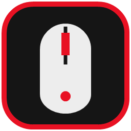
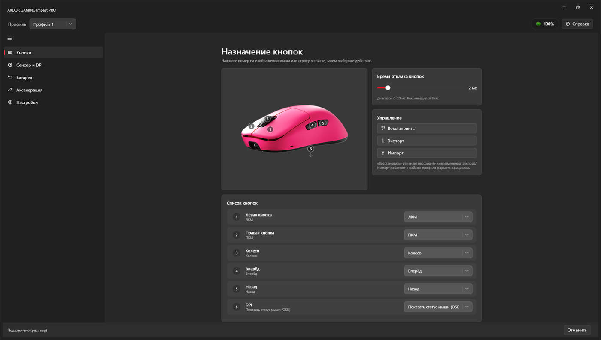
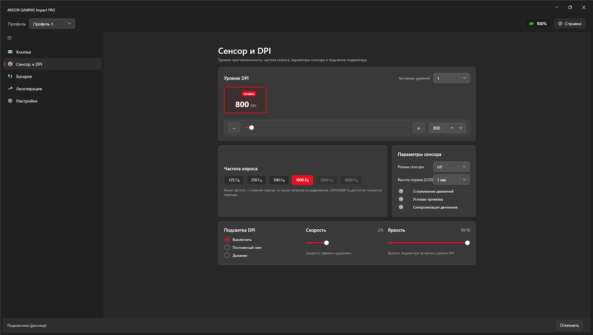
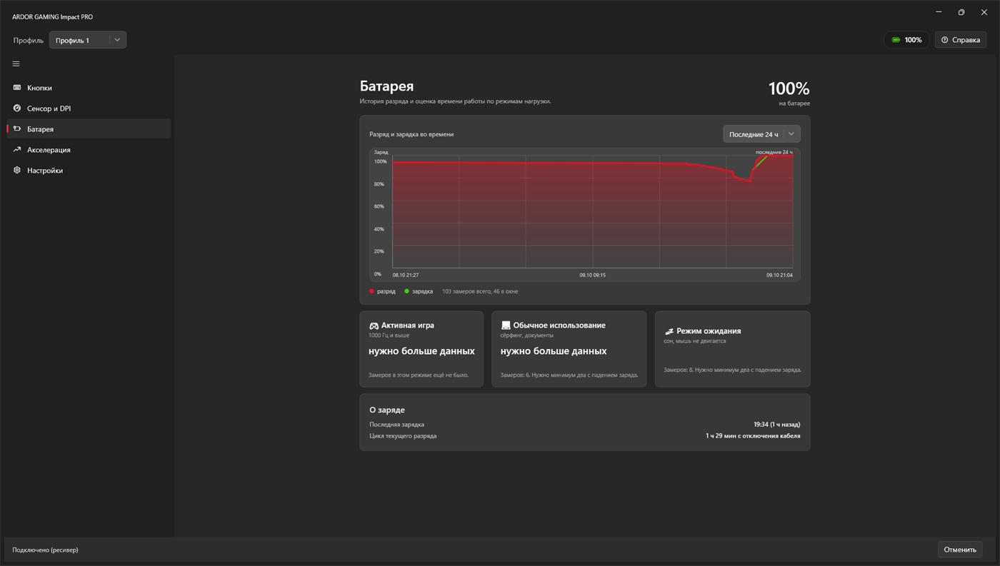
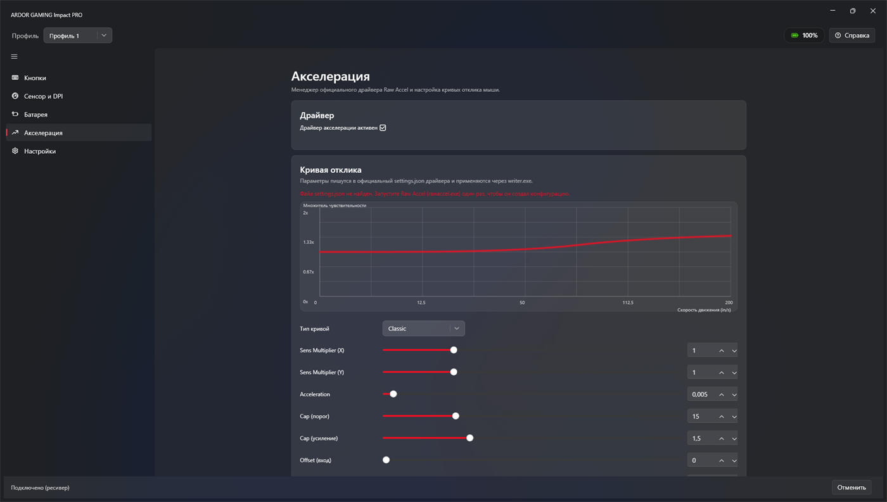
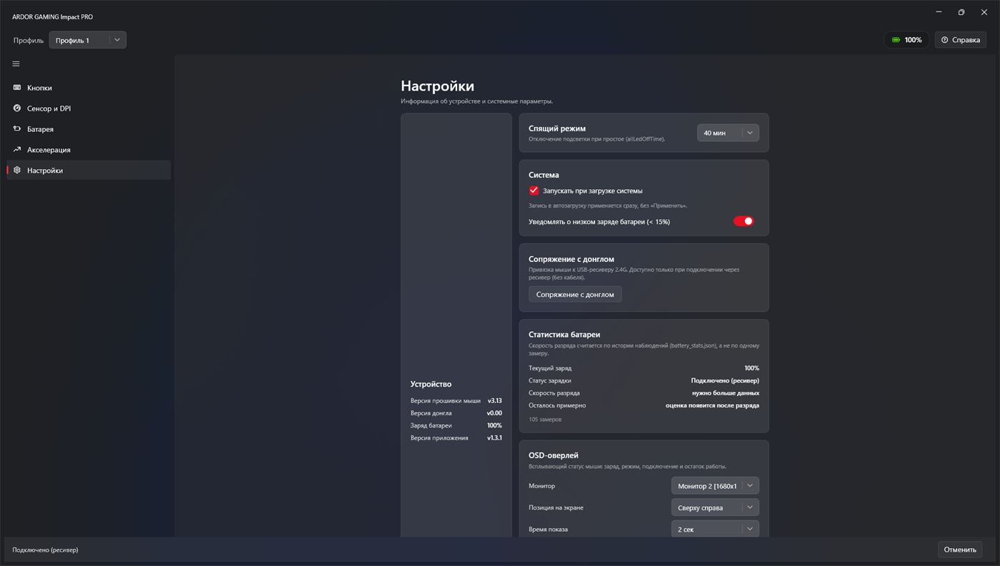

<div align="center">



# ImpactProConfig

### Modern configuration utility for the ARDOR GAMING Impact PRO

**PixArt PAW3395 · Wireless F53C / Wired F59A · WPF-UI (Fluent + Mica) · .NET 8**

[🇷🇺 Русский](README_RU.md) · **🇬🇧 English**

[](LICENSE)
[](https://learn.microsoft.com/windows)
[](https://dotnet.microsoft.com/download/dotnet/8.0)
[](#-vanguard--anti-cheat-safety)
[](#-honest-note-about-vibe-coding)
[](../../releases/latest)
[](ImpactProConfig.csproj)

[⬇ Download](../../releases/latest) · [📄 Releases](../../releases) · [🐛 Issues](../../issues) · [💬 Discussions](../../discussions) · [⭐ Star](../../stargazers) · [🍴 Fork](../../network/members)

</div>

---

## 📖 Table of Contents

- [Why another config tool](#-why-another-config-tool)
- [Comparison](#-comparison-impactproconfig-vs-vendor-software)
- [Features](#-features)
  - [Sensor — PixArt PAW3395](#-sensor--pixart-paw3395)
  - [Buttons](#-buttons--case)
  - [Connection & Hot-Plug](#-connection--hot-plug)
  - [Battery & OSD](#-battery--osd)
  - [Appearance](#-appearance)
  - [Raw Accel integration](#-raw-accel-integration)
  - [Install model & updates](#-install-model--updates)
- [Vanguard & Anti-Cheat Safety](#-vanguard--anti-cheat-safety)
- [Screens](#-screens)
- [Installation](#-installation)
- [Build from source](#-build-from-source)
- [Localization status](#-localization-status--honest)
- [Project structure](#-project-structure)
- [Disclaimer](#-disclaimer)
- [License](#-license)
- [Honest note about vibe coding](#-honest-note-about-vibe-coding)

---

## 💡 Why another config tool

The stock utility that ships with this mouse is a WinForms application from the Windows 7/8 era. It works, but it looks like it, it needs the vendor's own installer layout, and it gives you no feedback about what the mouse is doing right now.

ImpactProConfig is a ground-up rewrite on **.NET 8 + WPF-UI** (Fluent design, Mica backdrop, self-contained single-folder build). It speaks the same vendor HID protocol through the vendor's own `hidusb.dll`, but everything above that transport — UI, hot-plug handling, battery telemetry, OSD, updates — is new code.

**Unofficial.** Not affiliated with, endorsed by, or supported by ARDOR GAMING.

---

## ⚔️ Comparison: ImpactProConfig vs Vendor Software

| | **ImpactProConfig** | **Vendor utility** |
|---|---|---|
| **UI framework** | WPF + WPF-UI 3.0.4, Fluent controls, Mica backdrop, live accent theming | WinForms, era-appropriate flat UI, fixed colors |
| **Look and feel** | 5 accent themes (Ardor Red, Sakura Pink, Cyberpunk Cyan, Toxic Green, Deep Violet), dark | Single fixed skin |
| **Sensor** | 1–5 active DPI stages, per-stage X/Y value, stage colour and brightness | Same core values, no live preview |
| **Report rate** | 125 / 250 / 500 / 1000 Hz always; **2000 / 4000 Hz cable-only**, UI greyed out on wireless | Same limits, no explanation why high rates are unavailable |
| **DPI LED** | Mode (off / constant / breathing), speed 1–5, brightness 1–10 | Same core values |
| **Buttons** | 6 remappable slots, including the on-board "show OSD" action | Remapping available, no OSD action |
| **OSD status overlay** | Configurable: battery %, charge state, connection type, estimated runtime, monitor picker, duration 1/2/3/5 s | None |
| **Hot-plug cable ↔ receiver** | Background switch, cable-priority auto-detect, no restart, status bar reflects the live link | Manual re-selection required |
| **Battery reporting** | Live tray icon drawn per level (green / yellow / red + ⚡ while charging), hover tooltip, right-click menu | Basic indicator |
| **Battery telemetry** | `battery_stats.json`: measured drain rate in %/h and runtime estimate from real observations | None |
| **Low battery alert** | Native Windows toast below 15%, once per discharge, resets above 20% or on plug-in | None |
| **Sleep timer** | 10 s … 40 min | Same core values |
| **Body variant** | Black / White / Pink, or Auto by device MID (`MID 4→dev1, 5→dev2, 6→dev3`) | Image swap exists, mapping undocumented |
| **Raw Accel** | In-app manager: driver status, version, official-release update check, curve editor writing the official `settings.json` | Separate third-party app |
| **Updates** | In-app splash updater, NativeAOT, ~2 MB, pulls the portable ZIP from GitHub Releases | Manual download |
| **Install footprint** | Per-user, no admin for the portable build | Vendor installer, own layout |
| **Source** | Open source, CC BY-NC 4.0 | Closed |
| **Flash writes** | Only on **Apply**. Nothing else touches the mouse's flash | Not documented |

Numbers are deliberately not invented where I have not measured them. Startup and RAM depend on the machine; what is measurable here is the self-contained build size and the 2 MB updater.

---

## ✨ Features

### 🎯 Sensor — PixArt PAW3395

| Setting | Range / values | Notes |
|---|---|---|
| **Active DPI stages** | 1 … 5 | `maxDPI`. Slot count mirrors the device (`DPIMaxGrade=5`). |
| **Per-stage DPI** | X / Y value + stage index | 8 slot records exist in the device structure; 5 can be active. |
| **Report rate** | 125 · 250 · 500 · 1000 Hz | Always available. |
| **Report rate (high)** | 2000 · 4000 Hz | **Wired only.** Controls are disabled on the receiver, with the reason shown inline. |
| **Lift-off height (LOD)** | 0.7 mm · 1 mm · 2 mm | Device values `3 / 1 / 2`, taken from the vendor language file. |
| **Sensor power mode** | LP · HP | `sensorPowerSavingModeEnable`. LP lowers the sensor's own power draw. |
| **Motion Sync** | on / off | `motionSyncEnable`. |
| **Angle snapping** | on / off | Binds `linearCorrectionEnable`. |
| **Ripple control** | on / off | Binds `rippleControlEnable`, shown as "movement smoothing". |
| **Key debounce time** | 0 … 20 ms | Per-press response delay. Vendor default is 8 ms. |
| **Sleep timer** | 10 s, 30 s, 1, 5, 10, 15, 20, 25, 30, 35, 40 min | Idle time before the sensor sleeps. |
| **DPI LED** | off / constant / breathing, speed 1–5, brightness 1–10 | Stage colour follows the accent theme. |

### 🖱️ Buttons & case

- **6 remappable buttons**, every physical button included.
- The on-board action **"Show mouse status (OSD)"** is assignable to any button — that is how the overlay gets summoned without touching the tray.
- **3 body variants** — Black (`dev1`), White (`dev2`), Pink (`dev3`) — or **Auto (by MID)**.
- **Auto reads the MID from the device**, command 16 (`CS_UsbServer_ReadCidMid`). The vendor treats `dev1`/`dev2`/`dev3` as *Config.ini slots, not colours*: `DeviceTotal=3` with `[Device1] MID=4`, `[Device2] MID=5`, `[Device3] MID=6`, and `FormHomePage` picks the image whose section matches the MID. There is no MID→colour table anywhere in the vendor files. So Auto maps `4→dev1, 5→dev2, 6→dev3`, and an unknown MID is written to the log rather than silently guessed.
- The mouse image and the glowing podium repaint instantly on change.

### 🔌 Connection & Hot-Plug

- Device is `VID 3554`, receiver `PID F53C`, cable `PID F59A`.
- **Plug or unplug the cable and the active link switches in the background.** No restart, no re-scan dialog.
- When both endpoints are present the **cable wins** — it charges and it takes the radio off the link. Pull it and the app falls back to the receiver.
- Status bar reads the live link: `Подключено (провод)` / `Подключено (ресивер)`.
- High report rates are gated on the cable automatically.

### 🔋 Battery & OSD

- **On-screen OSD overlay** showing battery %, charge state, connection type and estimated runtime. Assign it to a mouse button.
- **Monitor picker** — displays are enumerated through Win32 `EnumDisplayMonitors` / `GetMonitorInfo` with resolution and primary flag, and the overlay is placed strictly inside the **work area (`rcWork`)** of the selected monitor, so it never lands on the taskbar or a reserved strip.
- **Overlay duration**: 1 / 2 / 3 / 5 s.
- **Low battery toast** — native Windows notification (WinRT `Windows.UI.Notifications`) below 15%, once per discharge session; state resets above 20% or when the cable goes in.
- **Live tray icon** — the taskbar icon is drawn in real time: colour-coded charge bar (green / yellow / red) plus a bolt while charging. Hover tooltip: `Impact PRO: [XX]% • Wireless/Wired`. Right-click menu: Open, Profile 1..4, Exit.
- **Battery telemetry** — discharge history is recorded to `battery_stats.json`, giving a **measured** drain rate in %/h and an estimate like `~12 h active gaming`. Both come from observations, not a lookup table. Until the mouse has actually discharged, the card says more data is needed instead of inventing a number.
- The OSD hotkey is a `WH_MOUSE_LL` low-level hook, because the vendor protocol does not report physical button presses over the wire. The hook can swallow the event so the click does not also reach the game.

### 🎨 Appearance

Five accent palettes, applied live:

| Theme | Hex |
|---|---|
| **Ardor Red** (default) | `#E81123` / `#FF2E2E` |
| **Sakura Pink** | `#F28CB4` |
| **Cyberpunk Cyan** | `#00E0E6` |
| **Toxic Green** | `#4FD63B` |
| **Deep Violet** | `#9B6BF5` |

Sliders, the active-DPI frame, buttons and the podium glow repaint the moment the palette changes.

### 🚀 Raw Accel integration

An **Acceleration** tab manages the official Raw Accel driver instead of shipping a fork of it.

- **Driver status and installed version**, read from the device and the version resource of `rawaccel.exe`.
- **Update check against the official repository** — `RawAccelOfficial/rawaccel` (`a1xd/rawaccel` redirects there; the final address is used so the check does not depend on the redirect).
- **The official archive is downloaded byte-for-byte as released and its own `installer.exe` is launched.** Nothing is patched. This is deliberate: `rawaccel.sys` is signed (WHQL/attestation), and any modification would break the signature — a signed vulnerable driver is exactly what makes Windows mark it unsafe.
- **Curve editor** — curve type, X/Y sens multiplier, acceleration, cap, and exponent. Values are written into the official `settings.json` and applied through the upstream `writer.exe`. Writing `settings.json` alone does nothing: the driver holds its config in memory, so the writer has to run.
- Install path is resolved so the official files land where the driver expects them, and the archive layout is preserved.

### 📦 Install model & updates

- **Per-user install**, same idea as Discord or Telegram: binaries in `%LOCALAPPDATA%\Programs`, user data in `%LOCALAPPDATA%\ImpactProConfig`. **Zero UAC prompts, zero admin rights** for the portable build.
- **Splash updater in the Discord style** — a separate `Updater.exe` published with `PublishAot=true` and `InvariantGlobalization=true`, **2 140 160 bytes (~2 MB)** on disk. A running executable cannot be overwritten, hence a second process.
- The app polls the GitHub Releases API in the background. A newer tag raises an InfoBar with **Download and update**: fetch the portable `.zip`, unpack it over the app folder, restart. No installer, no admin.
- The **MSI** route (`build-msi.ps1`) is a per-user install into `%LOCALAPPDATA%\Programs\ImpactProConfig`.

---

## 🛡️ Vanguard & Anti-Cheat Safety

This deserves a plain, factual explanation rather than a badge.

**ImpactProConfig is an ordinary user-mode GUI.** It runs as a normal Windows desktop application, in the same session as Explorer. It opens the mouse HID transport, sends vendor protocol commands, and draws windows. That is the whole of its privilege footprint.

Concretely, what this project does **not** do:

- It ships **no kernel driver**. There is no `.sys` file in this repository, no service registration, no kernel IOCTL of its own.
- It does **not** read or write another process's memory. No `WriteProcessMemory`, no `ReadProcessMemory`, no remote thread creation, no `CreateRemoteThread`, no APC injection.
- It does **not** inject code into any game process, and does **not** attach a debugger.
- It does **not** spoof, hook, or tamper with Riot, Vanguard, or any other anti-cheat, and does **not** attempt to hide from them.
- It does **not** touch the mouse driver stack to fake input. It configures the mouse *through the mouse's own vendor protocol* — the same channel the official software uses. Whatever the mouse physically does, the firmware does.

**About the Raw Accel tab:** Raw Accel is a **separate, upstream, Microsoft-signed driver**, not something this project ships or modifies. It is installed only if you ask for it, from the official release, using the official installer, and the app explicitly refuses to patch any release file so the signature stays valid. Whether you want it installed at all is your call — every core feature of ImpactProConfig works with no kernel driver present.

A low-level mouse hook (`WH_MOUSE_LL`) is used solely to notice the button you assigned to the OSD and to optionally consume that one click. It is a documented Win32 input hook running inside your own user session; it is not an injection.

Bottom line: this is configuration software for your own mouse, running at the same privilege level as Notepad. Treat it accordingly, and read the [disclaimer](#-disclaimer).

---

## 📸 Screens

| Buttons - action mapping | Sensor and DPI |
|---|---|
|  |  |

| Battery - discharge analytics | Acceleration - Raw Accel curve editor |
|---|---|
|  |  |

| Settings | OSD overlay |
|---|---|
|  |  |

All screenshots are from the shipping build, captured on a real device.

---

## 📥 Installation

**Portable (recommended)**

1. Download the newest `ImpactProConfig-v<Version>-Portable.zip` from the [Releases](../../releases) page.
2. Extract it to any folder you own — a Desktop folder, a USB stick, `D:\Tools`. No admin rights, nothing written to `Program Files`, nothing written to the registry.
3. Run `ImpactProConfig.exe`.

> `hidusb.dll` — the vendor protocol transport — ships next to the executable. **Keep the two together.** The application will not start the protocol without it. The in-app updater replaces both automatically.

**MSI, if you prefer a registered install**

`ImpactProConfig-v<Version>-Setup.msi` from the same page. It is a **per-user** install to `%LOCALAPPDATA%\Programs\ImpactProConfig` and does not request elevation.

### Requirements

- Windows 10 (1809 / build 17763) or later, x64
- ARDOR GAMING Impact PRO, on the 2.4 GHz receiver (F53C) or USB Type-C cable (F59A)
- No .NET install needed — the release is self-contained. Building from source needs the [.NET 8 SDK](https://dotnet.microsoft.com/download/dotnet/8.0).

---

## 🛠️ Build from source

```powershell
git clone https://github.com/jdh-lololosha/ImpactProConfig.git
cd ImpactProConfig

# Self-contained publish. SelfContained=true lives in the csproj, not on the
# command line — pass it by hand and the release ships without the .NET runtime.
dotnet publish -c Release -r win-x64 -o publish

# Pack publish\ into ImpactProConfig-v<Version>-Portable.zip and verify the
# updater binary is present.
.\build-portable.ps1
```

Other scripts:

| Script | Output |
|---|---|
| `.\build-portable.ps1` | Portable ZIP |
| `.\build-msi.ps1` | Per-user MSI + `installer.wxs` |
| `.\build-installer.ps1` | Installer artefacts |
| `.\create-release.ps1` | Tag + GitHub release upload |

**Note on layout:** `StructureTest` and `Updater` are nested projects and are explicitly excluded from the main project's glob (`DefaultItemExcludes`), otherwise their generated `AssemblyInfo.cs` breaks the WPF temp build with `CS0579`.

---

## 🌍 Localization status — honest

**There is no localization system in the project right now.** The UI strings are hardcoded Russian in the XAML and in `MainViewModel` — for example `SensorModeOptions = { "LP", "HP" }`, `LodOptions = { "0.7 мм", "1 мм", "2 мм" }`, `SleepOptions = { "10 сек.", … }`.

A `Languages/*.json` layer has been designed for and is not implemented yet. So this section describes the target format, and **the README does not pretend otherwise**:

```jsonc
// Languages/en.json
{
  "Dpi.Levels":          "Active DPI stages",
  "Sensor.LiftOff":      "Lift-off height (LOD)",
  "Sensor.PowerMode":    "Sensor power mode",
  "Buttons.Debounce":    "Key debounce time",
  "Battery.LowAlert":    "Notify on low battery",
  "Tray.Open":           "Open"
}
```

Anyone who wants to build it: extract every literal from `Pages/*.xaml` and the `*Options` arrays in `ViewModels/MainViewModel.cs`, key them, load on startup, and rebind. Contributions welcome.

---

## 🗂️ Project structure

```
ImpactProConfig/
├─ App.xaml(.cs)              Entry point, %LOCALAPPDATA%\ImpactProConfig, crash.log rotation
├─ MainWindow.xaml(.cs)       Mica shell, nav, update InfoBar
├─ PairingDialog.xaml(.cs)    Receiver pairing
├─ Driver/                    HID transport, protocol, marshalled structs
│  ├─ HidUsbNative.cs         P/Invoke into hidusb.dll
│  ├─ DeviceSession.cs        VID 3554, PID F53C/F59A, hot-plug arbitration
│  ├─ Protocol.cs             Command / report-rate enums
│  └─ Structures.cs           MouseConfig, DPIConfig, KeyFunMap, MacroContext — 1:1 with the vendor layout
├─ Services/                  OSD, tray, toast, themes, battery, updates, Raw Accel
├─ Pages/                     Dpi · Buttons · Acceleration · Settings
├─ ViewModels/                MainViewModel (~2100 lines), AccelerationViewModel
├─ Styles/Motion.xaml         Transitions
├─ Updater/                   Splash updater, NativeAOT, PublishAot=true
├─ build/                     installer.wxs
├─ Assets/                    app.ico, app-preview.png, dev1/2/3.png
├─ Assets/screens/            README screenshots (captured from the build)
└─ hidusb.dll                 Vendor protocol transport — required at runtime
```

Structures in `Driver/Structures.cs` are copied **1:1 from the decompiled vendor DriverLib**, `LayoutKind.Sequential`, sizes left to `Marshal`.

---

## ⚠️ Disclaimer

This is **unofficial, third-party software**. It is not affiliated with, endorsed by, sponsored by, or supported by ARDOR GAMING. It talks to the mouse over the same HID protocol as the official software, using the vendor's own `hidusb.dll`, and it is **not** an official release channel for firmware. Use it at your own risk. Keep a backup of your configuration via **Export** before applying anything. If your mouse misbehaves, power-cycle it and re-apply from the app; the device stores what you last wrote.

---

## 📄 License

**Creative Commons Attribution-NonCommercial 4.0 International — [CC BY-NC 4.0](LICENSE)**

Free to use, modify and share with attribution, **for non-commercial purposes only**. Commercial use is not permitted under this license.

---

## ✨ Honest note about vibe coding

This project was **vibe-coded with neural networks** ([OpenCode](https://opencode.ai)) under attentive human guidance, on real hardware, with real bug reports driving the fixes.

What that means in practice:

- The code is real, builds, runs, and was tested against an actual Impact PRO.
- **Comments explain *why*, not *what*,** because the reason is the hard part. Many of them record a mistake that already happened — a protocol command that was declared but never called, a settings file that gets written but never applied, a data directory that silently failed to open.
- Numbers come from measurement or from the decompiled vendor code, not from plausible guesses. Where a value is not known, the UI says it does not know.
- **You still need to read it.** An AI-written codebase is not automatically a reviewed one. Verify before you trust it with anything that matters.

The maintainer takes responsibility for the code. The blame is shared with the tooling.

---

<div align="center">

**Made for people whose mouse deserves better than a 2012 WinForms dialog.**

[🇷🇺 Русский](README_RU.md) · [🇬🇧 English](README.md)

</div>